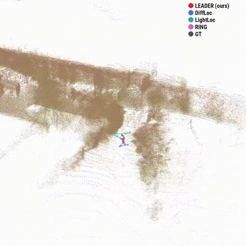

# LEADER: Learning Reliable Local-to-Global Correspondences for LiDAR Relocalization

**CVPR 2026 Highlight** | [📄 Paper](https://openaccess.thecvf.com/content/CVPR2026/papers/Wu_LEADER_Learning_Reliable_Local-to-Global_Correspondences_for_LiDAR_Relocalization_CVPR_2026_paper.pdf) | [📄 arXiv](https://arxiv.org/abs/2604.11355) | [🖼 Poster](https://cvpr.thecvf.com/virtual/2026/poster/39248) | [🤗 HF Paper](https://huggingface.co/papers/2604.11355)

LEADER is a robust LiDAR-based relocalization framework that learns reliable local-to-global point correspondences. It features a **Robust Projection-based Geometric Encoder** to capture multi-scale geometric features, and a **Truncated Relative Reliability (TRR) loss** to model point-wise ambiguity and mitigate unreliable predictions. Extensive experiments on Oxford RobotCar and NCLT datasets demonstrate that LEADER outperforms state-of-the-art methods, achieving **24.1%** and **73.9%** relative reductions in position error, respectively.

## 🎥 Demo

<p align="center">
  
</p>

## 📊 Results

<p align="center">
  
  
</p>

## 🛠 Installation

**Requirements**: GCC 7.5.0 / G++ 7.5.0, CUDA 11.6

```bash
conda create -n leader python=3.8 -y
conda activate leader
conda install openblas-devel -c anaconda -y
conda install cudatoolkit==11.6 gcc_linux-64=7.5.0 gxx_linux-64=7.5.0 -c conda-forge -c nvidia -y
conda install pip=22.3.1 -y
conda install --channel=conda-forge libxcrypt -y

# PyTorch 1.12 + CUDA 11.6
pip install torch==1.12.0+cu116 torchvision==0.13.0+cu116 torchaudio==0.12.0 --extra-index-url https://download.pytorch.org/whl/cu116

# Core dependencies
pip install numpy==1.22.3 setuptools==59.6.0
pip install matplotlib==3.7.5 open3d==0.18.0 tqdm==4.67.0 tensorboardX==2.6.2.2 accelerate==1.0.1 transforms3d==0.4.2 h5py==3.11.0 opencv-python==4.10.0.84

# MinkowskiEngine
export CUDA_HOME=/usr/local/cuda-11.6
pip install -U git+https://github.com/NVIDIA/MinkowskiEngine -v --no-deps --install-option="--blas_include_dirs=${CONDA_PREFIX}/include" --install-option="--blas=openblas"

pip install pypatchworkpp
```

## 🚀 Training & Evaluation

### Dataset Preparation

Download and organize datasets under `--dataset_folder`:

**NCLT** (`<dataset_folder>/NCLT/`):

```
NCLT/
├── 2012-01-22/
│   ├── velodyne_sync/              # LiDAR binary scans (*.bin)
│   └── groundtruth_2012-01-22.csv  # GT poses
├── 2012-02-02/
│   ├── velodyne_sync/
│   └── groundtruth_2012-02-02.csv
├── 2012-02-18/
├── 2012-05-11/
├── 2012-02-12/
├── 2012-02-19/
├── 2012-03-31/
└── 2012-05-26/
```

Train seqs: `2012-01-22`, `2012-02-02`, `2012-02-18`, `2012-05-11`  
Test seqs: `2012-02-12`, `2012-02-19`, `2012-03-31`, `2012-05-26`

**Oxford (Quality-enhanced)** (`<dataset_folder>/Oxford/`):

```
Oxford/
├── 2019-01-11-14-02-26-radar-oxford-10k/
│   ├── velodyne_left/              # LiDAR binary scans (*.bin)
│   ├── velodyne_left.timestamps
│   ├── gps/ins.csv
│   ├── rot_tr.bin                  # provided in data/oxford_gt/ (from SGLoc)
│   └── tr_add_mean.bin             # provided in data/oxford_gt/ (from SGLoc)
├── 2019-01-14-12-05-52-radar-oxford-10k/
├── 2019-01-14-14-48-55-radar-oxford-10k/
├── 2019-01-18-15-20-12-radar-oxford-10k/
├── 2019-01-15-13-06-37-radar-oxford-10k/
├── 2019-01-17-13-26-39-radar-oxford-10k/
├── 2019-01-17-14-03-00-radar-oxford-10k/
└── 2019-01-18-14-14-42-radar-oxford-10k/
```

Train seqs: `2019-01-11-14-02-26`, `2019-01-14-12-05-52`, `2019-01-14-14-48-55`, `2019-01-18-15-20-12`  
Test seqs: `2019-01-15-13-06-37`, `2019-01-17-13-26-39`, `2019-01-17-14-03-00`, `2019-01-18-14-14-42`

### Training

```bash
# Train on NCLT
python run_mink.py --dataset NCLT --mode train --dataset_folder /path/to/dataset

# Train on Oxford RobotCar
python run_mink.py --dataset Oxford --mode train --dataset_folder /path/to/dataset
```

Logs and checkpoints are saved to `log_{dataset}/` by default.

### Evaluation

Download pretrained checkpoints and run:

```bash
# Evaluate on NCLT
python run_mink.py --dataset NCLT --mode test --dataset_folder /path/to/dataset --resume_model /path/to/checkpoint

# Evaluate on Oxford
python run_mink.py --dataset Oxford --mode test --dataset_folder /path/to/dataset --resume_model /path/to/checkpoint
```

### Pretrained Models

| Dataset | GitHub | Hugging Face | Recall@1 | Trans. Err. (m) | Rot. Err. (°) |
|---------|--------|--------------|----------|-----------------|---------------|
| NCLT | [Download](https://github.com/JiansW/LEADER/releases/download/v1.0/nclt_checkpoint_epoch49.tar.gz) | [Download](https://huggingface.co/wushing001/LEADER/blob/main/nclt_checkpoint_epoch49.tar.gz) | 98.4 | 0.31 | 1.81 |
| Enhanced Oxford | [Download](https://github.com/JiansW/LEADER/releases/download/v1.0/oxford_checkpoint_epoch49.tar.gz) | [Download](https://huggingface.co/wushing001/LEADER/blob/main/oxford_checkpoint_epoch49.tar.gz) | 84.1 | 0.63 | 1.11 |

## 📜 Citation

If you find this work useful, please cite:

```bibtex
@InProceedings{Wu_2026_CVPR,
    author    = {Wu, Jianshi and Zhu, Minghang and Liu, Dunqiang and Li, Wen and Ao, Sheng and Shen, Siqi and Wen, Chenglu and Wang, Cheng},
    title     = {LEADER: Learning Reliable Local-to-Global Correspondences for LiDAR Relocalization},
    booktitle = {Proceedings of the IEEE/CVF Conference on Computer Vision and Pattern Recognition (CVPR)},
    month     = {June},
    year      = {2026},
    pages     = {9932-9942}
}