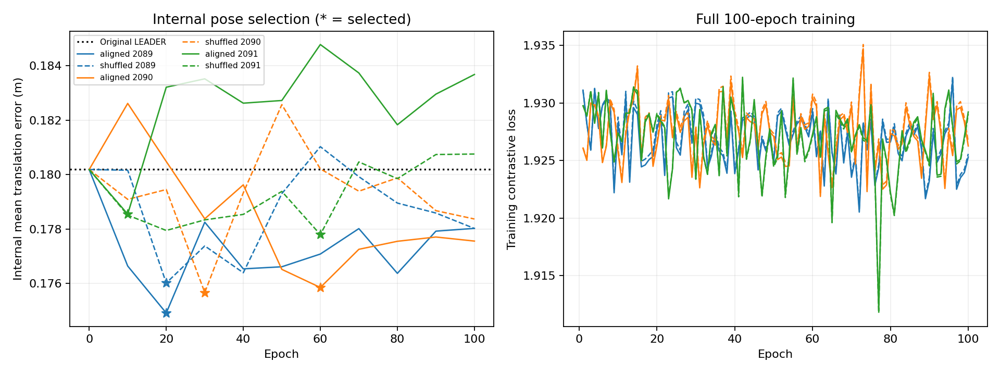

# 跨帧对比监督的锚定残差融合

**固定联合判据：未通过。** 排序读数与最终定位分别报告，不把匹配改善当作定位提升。

## 协议与核验

使用统一版本 905 帧缓存：578 帧训练，145 帧内部选模，182 帧固定开发评估；对比参考库仅来自训练部分。三个种子 × 正确／置乱两组，每组完整 100 epoch、7300 次更新。检查点只在内部最终平均位置误差上从 0、10、…、100 轮选择；零初始化可以获选，没有挑最佳种子。

37,408 参数的 640→32→512 小 MLP，只加范数不超过原特征 5% 的残差。原 top-K 最高可靠的一半及缺图点保持特征与回归输出严格不变；其他点可能改变可靠度排序，所以另记保护点最终保留率。没有收益门控、额外匹配头或回归头解冻。

训练目标为原 TRR + 0.01 倍温度 0.1 的多正例对比损失。查询是融合特征，参考是冻结原 LiDAR 特征；模糊距离不作负例。训练既含原排序正确点，也含错误点。原 coarse voxel 监督目标与真实代表点空间标签分开。结构、梯度、距离模糊标签忽略及 905 帧零初始化恒等性检查通过。



## 182 帧最终定位

| 方法 | 内部选中 epoch | 平均位置 m | 平均旋转 ° | 位置 P95 m | 固定原候选位置 m | 成功帧 1m/5° |
|---|---:|---:|---:|---:|---:|---:|
| 纯 LEADER | — | 0.122615 | 1.175877 | 0.250071 | 0.122615 | 182/182 |
| 历史① | 历史权重 | 0.119545 | 1.151790 | 0.243637 | 0.121185 | 182/182 |
| aligned_2089 | 20 | 0.120240 | 1.180142 | 0.233858 | 0.120335 | 182/182 |
| shuffled_2089 | 20 | 0.122113 | 1.167674 | 0.243941 | 0.122389 | 182/182 |
| aligned_2090 | 60 | 0.124563 | 1.183053 | 0.250071 | 0.123928 | 182/182 |
| shuffled_2090 | 30 | 0.121243 | 1.157157 | 0.233827 | 0.120636 | 182/182 |
| aligned_2091 | 10 | 0.122749 | 1.180703 | 0.244509 | 0.122945 | 182/182 |
| shuffled_2091 | 60 | 0.120466 | 1.174599 | 0.233231 | 0.121050 | 182/182 |

纯 LEADER 和①均在当前 182 帧上重新计算，未沿用旧 32 帧数值。①为旧训练权重的历史参考，其训练数据和预算不同。

## 固定候选消歧及保护

| 方法 | Top-1 | 纠正 | 损害 | 保护点最终保留率 | 原入选可见点坐标误差变化 m |
|---|---:|---:|---:|---:|---:|
| 纯 LEADER | 13.95% | 0 | 0 | 100.00% | +0.000000 |
| aligned_2089 | 14.01% | 25 | 21 | 100.00% | +0.015431 |
| shuffled_2089 | 14.01% | 30 | 26 | 100.00% | +0.018705 |
| aligned_2090 | 14.11% | 30 | 19 | 100.00% | +0.017526 |
| shuffled_2090 | 14.17% | 35 | 20 | 100.00% | +0.013010 |
| aligned_2091 | 14.08% | 28 | 19 | 100.00% | +0.008506 |
| shuffled_2091 | 14.04% | 30 | 24 | 100.00% | +0.019086 |

歧义点共 6937 个，其中 4571 个属于原 Matcher 候选、2197 个属于保护集合。原 Matcher 候选总数 71093，故歧义点占其 6.43%。分组排序结果详见 summary.json。

允许改变的原 Matcher 歧义点为 2374 个，占原 Matcher 候选 3.34%；这个交集不能等同于全部图像有效点上的歧义比例。

这里参考库从探针的 723 帧缩为仅训练的 578 帧，因此重新固定 LiDAR 前 16 候选及排序基线，不能直接沿用上一轮 7200 点的正确率。特征完全不变的查询保留原候选顺序，避免矩阵乘法与逐项乘加的舍入差异造成假纠正。

## 各日期平均位置误差 m

| 方法 | 2012-01-22 | 2012-02-02 | 2012-05-11 |
|---|---:|---:|---:|
| 纯 LEADER | 0.125647 | 0.113835 | 0.127200 |
| aligned_2089 | 0.124756 | 0.107892 | 0.126433 |
| shuffled_2089 | 0.128580 | 0.108464 | 0.127458 |
| aligned_2090 | 0.128494 | 0.114209 | 0.129610 |
| shuffled_2090 | 0.125918 | 0.108264 | 0.127824 |
| aligned_2091 | 0.128814 | 0.112078 | 0.125905 |
| shuffled_2091 | 0.122254 | 0.108679 | 0.128939 |

## 轨迹块配对不确定性

三个种子取逐帧均值，在每日期内对连续最多 10 帧的轨迹块重采样，超过 10 秒断开；10000 次、种子271828。负的位置差表示正确视觉更好。

```json
{
  "baseline": {
    "mean": -9.772255880273717e-05,
    "ci95": [
      -0.0018360053776334336,
      0.0015812142123010136
    ],
    "blocks": {
      "2012-01-22": 7,
      "2012-02-02": 6,
      "2012-05-11": 7
    }
  },
  "shuffled": {
    "mean": 0.0012438938826759224,
    "ci95": [
      -0.00030697027229804945,
      0.0031800593564451475
    ],
    "blocks": {
      "2012-01-22": 7,
      "2012-02-02": 6,
      "2012-05-11": 7
    }
  }
}
```

判据要求三个正确视觉种子均优于纯 LEADER 与配对置乱，并在每日期同向；配对区间上界低于零；旋转均值和位置 P95 不出现三个种子一致退化；排序也须胜过原 LiDAR 与置乱。

## 本轮解读

正确视觉只有种子2089的平均位置误差优于纯 LEADER，另两个种子略差；三种子均值相对 baseline 只低约 0.10 mm，轨迹块区间包含零。相对置乱，正确视觉三种子均值反而高约 1.24 mm，也未建立稳定优势。三个正确视觉模型的平均旋转误差均略高于 baseline。

匹配排序净纠正分别只有 +4、+11、+9，置乱为 +4、+15、+6；因此不能把这次小幅排序变化归因于正确的逐点视觉关联。前一轮直接视觉排序的阳性证据仍然成立，但当前锚定残差未将其转成稳定的融合定位收益。

35,502 个保护点在六组评估中均保持特征、回归输出不变，且最终候选保留率实际均为 100%；该结构性质成立，但不等于其余对应或整个定位流程不退化。

历史①在新182帧上平均位置为 0.119545 m，确实低于纯 LEADER 的 0.122615 m；不能把旧32帧的负结果直接外推到这个集合。但本轮没有为①补齐同预算三种子置乱对照，这个历史参考结果不构成稳健视觉贡献的证明。

本轮保留纯 LEADER 作为基线，不继续调整当前方案的幅度、温度或损失系数来追逐这182帧。

## 边界

182 帧已参与前一轮消歧探针和设计选择，不是盲测。PCA 复用训练日期图像拟合的版本。本实验不使用检索库做推理定位，参考库只用于训练监督及事后机制评价。即使排序改善，也不能据此宣布定位提升或完整 NCLT 改善。
