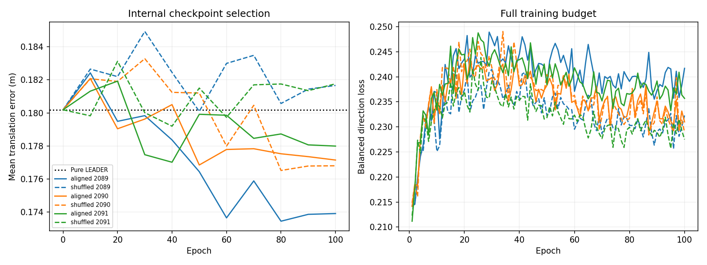

# 训练集证书监督的残差融合

固定联合判据：**未通过**。完整执行六组100 epoch，不按开发集调参。

## 固定设计与训练目标

同一 640→32→512 小头（37,408 参数），两层和偏置从头学习，末层零初始化；没有新门控或扩容。原保护集合、5%范数限制、MMRegressor、TRR、Matcher、特征缓存和投影不变。LEADER与视觉提取器冻结。推理不读取参考库或GT。

仅用578帧训练部分生成教师，参考同样只来自这578帧；145帧内部选模，182帧已接触开发集只做固定评估。沿用原固定16候选及近重复排除；无视觉选对筛选。P≤0.5m，N≥2m，G为中间距离。

教师间隔gamma=1e-4，求解可行裕量1e-8；固定正例下最小化半平方残差范数，再用原始/对偶证据核验最小性（间隙≤1e-8）与半径≤0.05。多个正例都求解，按最小范数及固定索引选取；有未决正例则跳过该查询。明确错误且获证点得到修正目标，原正确可调整点得到零目标；灰区、无正例、不可达或未决点只参加TRR。灰区只作为确保已知正例登顶的竞争者，不重标成负例。

教师送入冻结回归头，对原Matcher候选按原coarse voxel GT检查；场景坐标误差增大的修正被剔除，不改标为零。未入选Matcher的修正不做此筛选。最小范数和逐点坐标筛选均不保证姿态改善。

损失为原TRR + 0.01*Ldir；Ldir对实际施加残差按原特征范数和0.05归一化后计算平方L2误差。修正/保持两类在每批内分别平均，再对存在的类等权平均；没有跨帧对比损失。三个种子2089/2090/2091，配对初始化与样本顺序完全相同；每组100轮、7300更新。AdamW初始1e-3，5轮预热后余弦至1e-5，weight decay1e-4。内部最终位置误差从0、10、…、100轮选模，最早并列优先；不回灌182帧。

运行中出现过WSL实例暂时不可用；后段显存接近上限时，将固定教师张量改为CPU存放并按批传入GPU，已核验与GPU拼接数值逐位相同。没有更改目标、梯度公式、批顺序或有效训练预算；断点恢复使用上一个完整epoch的模型、优化器与样本随机状态，未完成epoch的临时更新丢弃后重放。细节见operational_notes.json。



## 教师可用性

```json
{
  "frames": 578,
  "totals": {
    "zero": 2255,
    "attempted": 4874,
    "certified": 1945,
    "kept": 1500,
    "coordinate_rejected": 445,
    "radius_blocked": 2927,
    "uncertain": 2,
    "gray_skipped": 20361,
    "no_positive": 31328,
    "protected_skipped": 20779
  },
  "frames_with_correction": 434,
  "frames_with_zero": 458,
  "dates": {
    "2012-01-22": {
      "zero": 795,
      "attempted": 1650,
      "certified": 619,
      "kept": 475,
      "coordinate_rejected": 144,
      "radius_blocked": 1030,
      "uncertain": 1,
      "gray_skipped": 7460,
      "no_positive": 12630,
      "protected_skipped": 7612
    },
    "2012-02-02": {
      "zero": 726,
      "attempted": 1460,
      "certified": 636,
      "kept": 495,
      "coordinate_rejected": 141,
      "radius_blocked": 824,
      "uncertain": 0,
      "gray_skipped": 5665,
      "no_positive": 8189,
      "protected_skipped": 5424
    },
    "2012-05-11": {
      "zero": 734,
      "attempted": 1764,
      "certified": 690,
      "kept": 530,
      "coordinate_rejected": 160,
      "radius_blocked": 1073,
      "uncertain": 1,
      "gray_skipped": 7236,
      "no_positive": 10509,
      "protected_skipped": 7743
    }
  }
}
```

6299份逐正例证书通过独立复算；保留修正最小间隔0.0001000097，最大范数0.04999025，平均范数0.02694831。单约束解析解、半径不可达、分类等权、跳过标签、零初始化、梯度流和保护检查通过。教师目标文件完整保存，可用verify_teacher.py --folder指定归档目录独立核验。

## 182帧最终定位

| 条件 | 选中epoch | 位置均值cm | 旋转均值° | 位置P95 cm | 固定候选位置cm |
|---|---:|---:|---:|---:|---:|
| 纯LEADER | — | 12.2615 | 1.1759 | 25.0071 | 12.2615 |
| aligned_2089 | 80 | 12.4208 | 1.1668 | 24.4509 | 12.4799 |
| shuffled_2089 | 50 | 12.4572 | 1.1845 | 25.0071 | 12.4555 |
| aligned_2090 | 50 | 12.2499 | 1.1838 | 24.4509 | 12.2155 |
| shuffled_2090 | 80 | 12.4130 | 1.1823 | 24.4509 | 12.4290 |
| aligned_2091 | 40 | 12.1949 | 1.1695 | 24.3637 | 12.1093 |
| shuffled_2091 | 40 | 12.5924 | 1.1684 | 25.5374 | 12.5732 |

## 方向覆盖与实际纠正

| 条件 | 原全空间可达 | 新子空间可达 | 实际纠正 |
|---|---:|---:|---:|
| aligned_2089 | 161 | 53 | 2 |
| shuffled_2089 | 161 | 51 | 3 |
| aligned_2090 | 161 | 55 | 1 |
| shuffled_2090 | 161 | 51 | 3 |
| aligned_2091 | 161 | 55 | 3 |
| shuffled_2091 | 161 | 51 | 2 |

上一轮正确视觉子空间/实际纠正为46/3、52/6、46/4；置乱为48/5、50/5、49/4。这里161点仅用于机制衔接，既不生成训练教师，也不用于选模。子空间可达仍是自由GT系数的松弛，不保证共享网络能表达或定位受益。

## 完整候选排序与损害

| 条件 | 歧义Top1 | 歧义纠正 | 歧义损害 | 全可见 N→P | 全可见 P→N | 全可见 P→G | 全可见 G→P |
|---|---:|---:|---:|---:|---:|---:|---:|
| aligned_2089 | 14.01% | 16 | 12 | 7 | 5 | 9 | 9 |
| shuffled_2089 | 14.03% | 14 | 9 | 8 | 4 | 7 | 6 |
| aligned_2090 | 14.10% | 16 | 6 | 7 | 0 | 8 | 9 |
| shuffled_2090 | 13.98% | 14 | 12 | 7 | 5 | 8 | 7 |
| aligned_2091 | 14.10% | 19 | 9 | 10 | 3 | 7 | 9 |
| shuffled_2091 | 14.03% | 16 | 11 | 6 | 4 | 8 | 10 |

完整30160个图像有效查询均计入P/N/G转移；G保留标签不确定，不并入明确错误。历史可比的6937歧义点另报原评价口径，原Top1为13.9542%。评价使用同一候选和固定排序；位姿Matcher配对随机状态与基线一致。

## 轨迹块配对比较

负值表示正确视觉位置误差更低。按日期内连续最多10帧、超过10秒断块，10000次重采样，种子271828；先计算三个种子的逐帧均值。

```json
{
  "baseline": {
    "mean": 0.00027001812208048154,
    "ci95": [
      -0.0015477497138932958,
      0.0021466756977325846
    ],
    "blocks": {
      "2012-01-22": 7,
      "2012-02-02": 6,
      "2012-05-11": 7
    }
  },
  "shuffled": {
    "mean": -0.001989961294764346,
    "ci95": [
      -0.0034624174200612264,
      -0.0005426241898868982
    ],
    "blocks": {
      "2012-01-22": 7,
      "2012-02-02": 6,
      "2012-05-11": 7
    }
  }
}
```

summary.json保留逐日期位置、旋转、P95、成功率、保护点保留率和固定候选结果。历史同结构对比损失六组结果保留在上级results，不作为本轮选模或调参依据。

## 结果解读

本轮未建立优于纯LEADER的稳定平均位置收益，继续保留纯LEADER。正确视觉三种子平均位置12.2885cm，相对纯LEADER的12.2615cm高0.270mm；轨迹块95%区间为[-1.548,+2.147]mm，包含零。一个种子退化、两个略有改善，且1月22日三个种子的位置均值都高于基线。

同时不能把所有对照都描述为没有差别：正确视觉在三个种子的平均位置上都优于对应置乱，种子均值差为-1.990mm，轨迹块95%区间[-3.462,-0.543]mm。这个结果支持当前开发集上正确与置乱条件存在位置差异，但跨日期并非处处同向，也没有转成超过纯LEADER的稳定平均位置收益；不能概括为图像完全未被使用。

方向覆盖从旧正确模型46/52/46增至53/55/55，但原161点上的实际纠正从3/6/4降为2/1/3；置乱为3/3/2。明确方向监督没有建立预期的实际纠正增益。完整6937歧义点的正确视觉Top1仍只有14.01%–14.10%，相对13.9542%的基线变化很小，且未在全部配对种子中优于置乱。不能只用子空间覆盖略增宣布监督有效。

尾部读数有改善：正确视觉三个位置P95均低于纯LEADER；旋转均值两组更好、一组更差。全部六组182/182通过1m/5度条件，保护点最终保留率均为100%。这些读数保留，但不替代预先固定的平均位置与视觉对照判据。

训练日志中的方向损失在第一轮约0.211–0.215，最后一轮约0.227–0.242，没有呈现期望的下降；总损失下降并不等于方向教师被拟合好。日志本身不足以区分输入信息、共享表达约束与联合损失冲突，不能据此确认某一个失败原因，也不据此调整lambda或继续延长训练。

所有1500个保留教师在实际float32特征加法后仍满足正间隔gamma：最小间隔0.00010000537、最大归一化残差0.04999025；零个点跌破gamma。新子空间证书、配对初始化和选模记录均通过独立审计。

## 适用边界

182帧是已经参与机制研究的开发集，不是盲测；没有完整NCLT提升结论。只增加方向覆盖不算成功，排序改善但定位不改善也不算成功，正确视觉未稳定优于置乱时不归因于逐点视觉贡献。训练方向标签仅来自578帧；先前开发集161点证书没有用于蒸馏。
