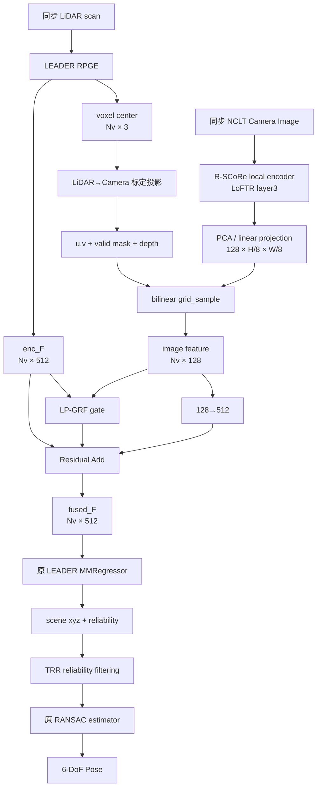

# LEADER 与 R-SCoRe 的特征层多模态重定位融合设计：LiDAR 主导的投影门控残差融合

## 执行摘要

我建议只采用一个方案：**LiDAR 主导的投影门控残差融合（LiDAR-guided Projected Gated Residual Fusion，简称 LP-GRF）**。

核心思想非常简单：

> **LEADER 继续做主干和最终定位；R-SCoRe 不再单独输出位姿，而只提供局部图像特征。把 LEADER 编码器得到的每个 512 维 LiDAR voxel 特征，通过 LiDAR–camera 标定投影到同步图像，在 R-SCoRe 的 128 维局部特征图上双线性采样；然后用一个很小的门控残差模块，把“有帮助的图像信息”加回 LEADER 的 512 维特征，再原封不动送入 LEADER 原来的 MMRegressor 和 TRR/RANSAC pipeline。**

这是我认为最适合你当前条件的设计，而不是直接拼接两套完整的定位系统。LEADER 官方代码已经把 `encoder` 与 `decoder` 明确拆开：`enc = model.encoder(input)` 后直接取得 `enc.F`，随后 `model.decoder(enc_F)`；官方模型中这正是 **512 维 encoder 输出 → 512 维 MMRegressor 输入** 的接口。因此融合模块可以精确插在这两行之间，对 LEADER 的侵入极小。citeturn21view3turn22view0

R-SCoRe 方面也不建议使用其完整的“全局检索 → global encoding hypotheses → SCR MLP → PnP/RANSAC”路径。R-SCoRe 官方论文明确说明，其 LoFTR 版本使用 **layer 3 后、空间分辨率为输入的 1/8 的 dense CNN feature grid**，再通过 PCA 压到 **128 维**；而完整 R-SCoRe 推理还要运行 NetVLAD、SCR MLP 和 PnP，论文报告总耗时约 140–270 ms，而 LoFTR 局部特征本身约 7 ms（这些数字来自 RTX 2080、640×480，不能直接与 LEADER 的 RTX 3090 结果相加）。因此，只借用 R-SCoRe 的 **128D local encoding**，既符合“图像只给 LEADER 补充信息”，又能避免把 R-SCoRe 在 NCLT 上的独立定位弱点传递给最终系统。citeturn23view0turn23view1turn23view2

在 NCLT 上，时间同步其实比表面看起来容易：官方数据说明 `velodyne_sync` 中的每个 LiDAR scan **就是与一幅 Ladybug3 图像关联的，并按照对应图像的 UTIME 命名**；图像自身也是 `UTIME.tiff`。因此 LEADER 当前已经使用的 `velodyne_sync/<UTIME>.bin` 可以直接寻找同 UTIME 的相机图像，而不必先做模糊的最近邻时间同步。NCLT 官方还提供 Velodyne–Ladybug3 外参与各相机内参，并明确提供过 Velodyne 点投影到图像的示例脚本。citeturn18view1turn17view2turn16view0

**本文推荐的默认数据流是：**

```text
LiDAR scan
   │
   ▼
LEADER RPGE
   │
   │ enc_F: [Nv, 512]
   │ voxel center: [Nv, 3]
   │
   ├───────────────┐
   │               │  标定投影
   │               ▼
   │         同步 NCLT image
   │               │
   │         R-SCoRe / LoFTR
   │               │
   │        [128, H/8, W/8]
   │               │
   │      双线性采样到 voxel
   │               │
   │          [Nv, 128]
   │               │
   └──────► 门控残差融合
                   │
             [Nv, 512]
                   │
             LEADER decoder
                   │
            scene xyz + reliability
                   │
              TRR filtering
                   │
                RANSAC
                   ▼
               6-DoF pose
```

融合本身只有约 **0.116M 个推理参数**，相对于 LEADER 官方的约 69.67M 参数约增加 **0.17%**；训练时再加两个仅用于 LiDAR→image 蒸馏的小 projector，总新增约 0.157M，蒸馏头推理时直接删除。LEADER 官方 NCLT baseline 是 **0.31 m / 1.81°**、48 ms、69.67M 参数，因此真正新增的主要推理成本预计不是融合 MLP，而是图像局部特征抽取；具体端到端延迟必须在你的硬件上重新测量。citeturn22view4turn23view2

我不建议一开始上 cross-attention。DeepFusion 的确证明了“**camera feature 与 deep LiDAR feature 融合**”比把 camera feature 装饰到 raw point 上更有效，并使用 cross-attention 做 LearnableAlign；但你的 LEADER 已经给出了精准的 voxel→3D center，NCLT 又有明确标定，所以可以先利用**确定性的几何对应关系**，用投影 + 采样 + gate 完成融合。这样更容易在真实 LEADER 代码中调通，也更容易判断图像究竟有没有提供互补信息。citeturn19view0turn19view1

**最关键的训练设计**是：不要要求 R-SCoRe 独立在 NCLT 上学会定位，而是增加一个 **LiDAR→image feature distillation loss**，让同步位置的 128D 图像特征向高可靠 LEADER 512D deep feature 的低维投影靠拢。最终任务仍只由 LEADER 的 TRR 定位损失决定。类似的跨模态 contrastive/feature alignment 已被多模态 3D 感知研究证明可以改善异构模态对齐，尤其在标定和时间存在轻微误差时。citeturn20search2turn20academia19

对于效果，我不会把“融合一定提升”当作事实。LEADER 本身在 NCLT 已经非常强，官方结果 0.31 m 留给融合的提升空间有限。比较合理的研究目标是：**平均位置误差获得约 3–8% 的相对改善，同时重点改善 99% tail error 和困难季节帧；若最终从 0.31 m 到约 0.29–0.30 m 且 99% 阈值显著低于官方 1.23 m，就已经是有意义的正结果。** 这只是实验目标，不是已有文献结果。citeturn22view4

## 背景、接口与明确假设

LEADER 属于 LiDAR Scene Coordinate Regression。它不是直接把整帧点云回归成 pose，而是先预测大量 local-to-global 3D correspondence 和每个 correspondence 的可靠度，再经过可靠度筛选和 RANSAC 求最终 6-DoF pose。官方论文中的 RPGE 首先做 cylindrical spatial transformation，然后使用 cyclic sparse-convolution U-Net；encoder 通道逐级为 `[32, 64, 128, 256, 384]`，最终上采样并融合后投影为 **512D feature**，MMRegressor 再将 512D feature 回归为 **3D scene coordinate + 1D reliability**。citeturn21view1turn21view2

官方代码与论文是对得上的：`LEADER(in_channels=3, feat_channels=512)`，RPGE 输出后送入 `MMRegressor(feat_channels=512, head_channels=512, head_num=4, layers=5)`；MMRegressor 内部主要采用 Linear、LayerNorm、LeakyReLU 和 multi-head max。citeturn22view0turn22view1

LEADER 的输入也不是普通 Cartesian xyz feature。官方数据代码先把点变成 cylindrical representation，给每个 voxel 构造 `[height, range, intensity]` 三维输入 feature，并通过 MinkowskiEngine `sparse_quantize` 形成 sparse tensor。NCLT loader 默认 `level_correction=False`；如果打开地面校正，它会先用估计的平面变换点云，并把该 correction 一起返回。citeturn21view1turn21view2turn22view3

R-SCoRe 则是视觉 SCR。完整 R-SCoRe 会把 local encoding 与 image-level global encoding 结合，然后预测图像 keypoint 的世界 3D coordinate，最终用 PnP/RANSAC 求 camera pose。其 global encoding 是基于训练图像共视图学习得到的 256D Node2Vec embedding；测试时还需要检索多个训练图像的 global hypotheses。citeturn23view0turn23view1

但对本项目真正有用的是 **local encoding，而不是完整 R-SCoRe 输出**。R-SCoRe 对 LoFTR 的使用方式非常适合本设计：论文直接取 LoFTR CNN layer 3 后的 feature grid，其空间尺寸是输入图像的 1/8，并把每个 cell 中心视为 keypoint；随后 PCA 压缩到 128D，论文报告 128D 通常能保留超过 90% 的 local encoding variance。citeturn23view1

因此建议统一下面的接口：

| 张量 | 推荐统一 shape | 来源 | 状态 |
|---|---:|---|---|
| `enc_F` | `[Nv, 512]` | LEADER RPGE 输出 | **明确** |
| `enc_C` | `[Nv, 4]` | Minkowski coordinate，第一列 batch id | **明确** |
| `p_lidar` | `[Nv, 3]` | `enc_C → voxel center → polar_expansion_to_cartesian` | **明确** |
| R-SCoRe local map | `[B, 128, H/8, W/8]` | LoFTR layer3 + PCA | **语义/维度明确，实际代码内存布局未指定** |
| sampled image feature | `[Nv,128]` | 本文新增 bilinear sampler | **新增** |
| gate | `[Nv,1]` | 本文新增 | **新增** |
| fused feature | `[Nv,512]` | 本文新增 | **新增** |
| LEADER decoder output | `[Nv,4]` | xyz + reliability | **明确** |

其中 `Nv` 是 RPGE 输出的当前 batch 非空 sparse voxel 总数，不应硬编码。

这里有几个必须明确的“未指定项”。

**R-SCoRe 具体代码中的 local feature tensor 名称：未指定。** SCRStudio 官方仓库明确支持 R-SCoRe、local encodings 和 PCA 128D preprocessing，但 README 没有固定一个公开 API 说“这里返回 `[B,128,H/8,W/8]`”。论文则明确给出了 LoFTR layer3/1⁄8/PCA-128 的定义。保守做法是先离线导出 post-PCA 128D feature map；更深入集成时再把这一 tensor 改造成在线、可反传接口。citeturn23view4turn23view1

**LEADER 官方 NCLT loader 中的 camera 输入：未指定，而且实际上当前 loader 不加载图像。** 代码虽然有一句注释 “read the image timestamps”，实际读取的是 `velodyne_sync` 目录里的 `.bin` 文件名，并将这些时间戳用于 LiDAR/GT pose；`__getitem__()` 最终只返回 `coords, feats, scan, transform, correction`。所以你需要扩展 dataset/collate，让它额外返回图像或预计算 image feature。citeturn22view2turn22view3

**NCLT 的 LiDAR–image 时间关联却不是未指定。** 官方资料明确说明 Ladybug 图像以 UTIME 命名，而且 `velodyne_sync` 中每个 scan 就是“associated with each image”，scan 文件按照对应 image 的 UTIME 命名。因此最简单的正确实现不是 nearest-neighbor timestamp，而是：

```text
velodyne_sync/135xxxxxxxxxxxxx.bin
            ↓ 同一个 UTIME
lb3/Cam?/135xxxxxxxxxxxxx.tiff
```

NCLT 原始 Velodyne 为 10 Hz，而 Ladybug3 是 5 Hz、六个 1600×1200 相机，其中五个组成水平环、一个朝垂直方向；`velodyne_sync` 已经帮用户提供了与图像事件关联的单圈 scan。citeturn18view0turn18view1turn17view3

**具体使用哪个 Camera ID：未指定。** NCLT 有 Cam0–Cam5 和完整的 camera-frame 标定，但仅从编号本身不应该猜哪一个是你的“前视相机”。保守实现中，先通过官方 projection/calibration script 验证一个面向行驶方向的水平 camera，再固定使用它；激进实现再扩展为五个水平 camera。官方 NCLT 页面还特别记录了相机参数表曾更正，并提供过点云投影到图像的脚本，因此这里最好直接使用最新官方 calibration 文件，而不是抄论文表格常数。citeturn16view0turn17view2

最后需要区分一个重要事实：**“R-SCoRe 在 NCLT 单独表现差”是你给出的实验前提，不是 R-SCoRe 官方论文中的 NCLT 结论。** R-SCoRe 官方材料集中在 Aachen、Hyundai Department Store 等视觉定位 benchmark；因此本文不会假定一个官方 NCLT R-SCoRe 数值，也不会让最终设计依赖它的 standalone pose accuracy。citeturn23view2turn23view3

## 选择的方法与模块结构

我建议把模块叫做：

**LP-GRF：LiDAR-guided Projected Gated Residual Fusion**

它本质上由三个动作组成：

1. **Project**：把 LEADER voxel center 投到图像。
2. **Sample**：从 R-SCoRe 128D local map 上取对应 image feature。
3. **Gate + Residual**：由当前 LiDAR feature 与 image feature 一起决定这条 image information 应该加多少，而不是无条件 concatenate。

它借用了多模态 3D detection 已验证有效的“3D element 投影到图像 → 获取对应 image feature → 与 3D feature 融合”的基本思想。MVX-Net 的 PointFusion/VoxelFusion 就是把 3D point/voxel 通过 calibration 投影到图像后取 CNN feature；DeepFusion 后续进一步显示，把 image feature 与 **deep LiDAR feature** 融合比只修饰 raw point 更有潜力。这正对应本方案选择 `enc_F` 而非 LEADER 原始三维输入的位置。citeturn19view1turn19view0

设 LEADER 对第 \(i\) 个 voxel 的 feature 为

\[
\mathbf f_i^L\in\mathbb R^{512}
\]

投影到图像并采样后的 R-SCoRe feature 为

\[
\mathbf f_i^I\in\mathbb R^{128}.
\]

首先只在支路内部归一化：

\[
\bar{\mathbf f}_i^L=LN(\mathbf f_i^L),\qquad
\bar{\mathbf f}_i^I=LN(\mathbf f_i^I).
\]

然后分别压缩为 64D gate descriptor：

\[
q_i^L=
\mathrm{LReLU}(W_L\bar f_i^L),\quad
W_L:512\to64
\]

\[
q_i^I=
\mathrm{LReLU}(W_I\bar f_i^I),\quad
W_I:128\to64.
\]

门控输入为

\[
[q_i^L,q_i^I,r_i,m_i]\in\mathbb R^{130},
\]

其中：

- \(r_i\) 是归一化 LiDAR range；
- \(m_i\in\{0,1\}\) 表示该 voxel 是否有合法 camera correspondence。

门控网络：

\[
g_i=
\sigma
\left(
W_{g2}
\,\mathrm{LReLU}
\left(W_{g1}
[q_i^L,q_i^I,r_i,m_i]\right)
\right)
\]

shape 为：

```text
130 -> 64 -> 1 -> sigmoid
```

同时 image feature 直接被线性映射回 LEADER feature space：

\[
\Delta f_i^I=W_\Delta\bar f_i^I,\qquad W_\Delta:128\to512.
\]

最终：

\[
\boxed{
f_i^{fuse}
=
f_i^L+
\alpha\,m_i\,g_i\,\Delta f_i^I
}
\]

推荐让 \(\alpha\) 为一个可学习 scalar，但初值只设为 **0.1**，而不是 1。

这个公式是整个方案最重要的一点：

> **image 只能给 LEADER 增加一个受控 residual；它没有权力把 LEADER feature 整体替换掉。**

所以没有合法图像时 \(m_i=0\)：

\[
f_i^{fuse}=f_i^L.
\]

这意味着 camera 缺帧、voxel 不在 FOV、投影无效时，网络天然回退到原 LEADER，而不是需要另写一套 missing-modality 分支。

我也**不建议在残差之后再做 LayerNorm**。LEADER 的 decoder 已经是在原始 512D RPGE feature distribution 上训练的；如果融合后再整体 LN，即使 image mask 全零也不再等价于原 baseline。本文只在两条支路内部使用 LayerNorm，最后保留原 `enc_F + residual` 的数值结构。LEADER 自己的 MMRegressor 已大量采用 LayerNorm + LeakyReLU，所以 adapter 中继续使用 LeakyReLU，也能减少激活函数风格差异。citeturn22view1

模块的推理参数约为：

| 组件 | 参数量约 |
|---|---:|
| `LN(512)` | 1,024 |
| `LN(128)` | 256 |
| `512→64` LiDAR gate projection | 32,832 |
| `128→64` image gate projection | 8,256 |
| `130→64→1` gate MLP | 8,513 |
| `128→512` image residual projection | 65,536 |
| scalar `α` | 1 |
| **总计** | **约 116,354 ≈ 0.116M** |

相对 LEADER 官方 69.67M，大约是 **0.17%** 参数增量。LEADER 官方 ablation 中 NCLT 模型为约 69.67M、48 ms，因此从纯参数规模看 adapter 很小；但是实际耗时还依赖 `Nv`，更重要的是 camera backbone，所以延迟必须实测。citeturn22view4

整个流程可以画成：



之所以没有采用 cross-modal attention，并不是 attention 无效。DeepFusion 专门提出 LearnableAlign cross-attention 来处理经过增强、聚合后不容易几何对齐的 image/LiDAR deep features，并取得了检测增益。这里的判断是：**NCLT 已给出物理标定，而 LEADER 又能恢复每个 sparse feature 对应的 3D voxel center，因此首先使用确定性的几何投影更加符合“清晰、容易实现、方便调试”的目标。**citeturn19view0

## 融合落点、时间与空间对齐

LEADER 中融合位置可以非常具体。

官方 `run_mink.py::process_one_epoch()` 当前核心代码是：citeturn21view3

```python
enc = model.encoder(input)

enc_C = enc.C
enc_F = enc.F

stride = torch.tensor(enc.tensor_stride, ...)
voxel_centers = (enc_C[:, 1:].float() + stride / 2) * voxel_size
voxel_centers_l = polar_expansion_to_cartesian(...)

pred_f = model.decoder(enc_F)
```

**本文唯一推荐的插入点：**

```python
enc = model.encoder(input)

enc_C = enc.C
enc_F = enc.F

# 原代码已有
voxel_centers = ...
voxel_centers_l = ...

# ===== 新增 =====
img_feat = image_encoder(image)
sampled_img_feat, img_valid = project_and_sample(
    voxel_centers_l, img_feat, calibration, ...
)

fused_F = fusion(
    lidar_feat=enc_F,
    image_feat=sampled_img_feat,
    valid_mask=img_valid,
    range_m=voxel_centers_l.norm(dim=-1),
)

# 原来是 model.decoder(enc_F)
pred_f = model.decoder(fused_F)
```

这一位置尤其合适，因为 `enc_F` 已经是论文描述的、包含 local geometry 与 global context 的 512D deep embedding，同时 `voxel_centers_l` 在同一段代码中已经被恢复出来。也就是说，不需要逆向追踪 Minkowski sparse convolution 中间每一层的 point correspondence。citeturn21view2turn21view3

**时间对齐。** 对 NCLT，推荐直接用 **相同 UTIME**。LEADER 当前 `NCLT_mink` 从 `velodyne_sync` 文件名读取时间戳；NCLT 官方说明 `velodyne_sync` 文件本来就是一幅图像对应一个 scan，文件名采用对应 image 的 UTIME，而 camera image 也用 UTIME 命名。citeturn22view2turn18view1turn17view3

因此可以在 dataset 里把：

```python
scan_path = ".../velodyne_sync/<utime>.bin"
```

扩展为大致：

```python
image_path = ".../lb3/CamX/<utime>.tiff"
```

真实解压目录结构请以你的 NCLT 数据组织方式为准；**LEADER 官方仓库目前只要求 `velodyne_sync + groundtruth`，没有规定 camera 文件应放在哪里。**citeturn21view0

如果以后换到“类似 NCLT、但没有预同步 scan”的数据集，再采用最近时间戳匹配即可。推荐先设：

\[
|\Delta t| < 50\text{ ms}
\]

作为工程初值；这不是 NCLT 官方参数，而是本文建议。超过阈值直接令 `m=0` 比硬融合错误图像更安全。

**空间对齐。** 建议使用 NCLT 官方 Velodyne→Ladybug3 外参以及每个 camera 的 intrinsics/distortion calibration。NCLT 论文专门描述了 Velodyne–Ladybug3 calibration，并给出了各 camera frame 和 intrinsics；官方网页还提供过投影示例脚本。citeturn17view1turn17view2turn16view0

概念上：

\[
p_C = T_{C\leftarrow L}p_L
\]

然后只有满足

\[
z_C>0
\]

且投影像素落在合法图像区域内的 voxel 才设 `m=1`。

如果图像已经 resize 为 640×480，就必须同时修改 intrinsics：

\[
f_x' = s_x f_x,\quad
c_x'=s_xc_x
\]

\[
f_y'=s_yf_y,\quad
c_y'=s_yc_y.
\]

R-SCoRe 官方 runtime 是在 640×480 下报告的，而 NCLT Ladybug3 原图是 1600×1200，所以 **640×480 是很合理的第一版实验分辨率**，但这是本文工程建议，不是 NCLT 或 R-SCoRe 的强制设置。citeturn23view2turn18view0

投影到原图得到 \((u,v)\) 后，LoFTR local feature map 是 1/8 尺度，因此理论位置是：

\[
(u_f,v_f)=(u/8,v/8).
\]

实际实现最好不要手动 round，而直接换算成 `grid_sample` 所需的 `[-1,1]` normalized coordinate，并使用 bilinear interpolation。R-SCoRe 官方 LoFTR local encoding 的 1/8 spatial grid 是明确的。citeturn23view1

还建议增加一个非常简单的 **z-buffer mask**：

> 如果多个 LEADER voxel 落进同一个 image-feature cell，只保留 camera depth 最小或接近最小的那些 voxel 的 image correspondence。

否则一个被前景遮挡的 LiDAR voxel 也可能采到前景图像纹理。第一版甚至可以按 1/8 feature cell 而不是每个 pixel 做 z-buffer，足够简单。

LEADER 的 `level_correction` 需要单独注意。默认值是 `False`；如果保持默认，`voxel_centers_l` 可直接按正常 LiDAR local frame 处理。如果你打开 `level_correction=True`，代码在进入 RPGE 前已经对 scan 施加了平面矫正，而返回的 `T_corr` 记录该 correction，因此 camera projection 前应先把 voxel center **逆变换回实际 LiDAR sensor frame**，然后再乘 camera extrinsic。否则视觉与 LiDAR feature 会系统性错位。citeturn22view2turn22view3turn21view3

图像增强也必须遵守同样原则。DeepFusion 特别指出，多模态融合中几何 augmentation 会破坏 LiDAR–image alignment，因此专门设计了 InverseAug。对于本项目，最简单的做法不是再实现 InverseAug，而是：

> **第一版融合训练只允许已知 resize 和 photometric augmentation；不要独立做 random crop/rotation，也不要对 LiDAR 做不能同步映射到 camera projection 的 yaw augmentation。**

这样可以直接避开一大类 alignment bug。citeturn19view0

对于代码中仍然未指定的两个问题，可以保留两级实现，但它们属于**同一个 LP-GRF 方法的工程落地方式**：

| 未指定项 | 保守实现，建议先做 | 后续更完整实现 |
|---|---|---|
| R-SCoRe feature 接口 | 预计算并保存 post-PCA 128D grid | 在线调用 LoFTR layer3，并用 Torch PCA layer 保持梯度 |
| Camera 数量 | 只选一个已确认朝水平方向且覆盖主要行驶方向的 camera | 使用五个水平 camera；同一 voxel 多视图有效时做有效 feature 的加权平均 |

我建议真正开始写代码时先做左列，因为它能最快回答最重要的问题：

> **“同步视觉 local feature 到底能不能给已经很强的 LEADER 提供额外信息？”**

## 训练策略与 LiDAR 辅助图像学习

训练目标应保持 **LiDAR 定位任务为主、图像 feature alignment 为辅**。

最主要的 loss 完全保留 LEADER 原来的 TRR：

\[
\mathcal L_{\mathrm{loc}}
=
\mathcal L_{\mathrm{TRR}}
\left(
\mathrm{Decoder}(F_{\mathrm{fused}})
\right).
\]

不要增加一个“R-SCoRe 自己必须正确输出 NCLT pose”的独立 localization loss。这样设计直接符合你的前提：**R-SCoRe 不需要成为一个好的 NCLT standalone localizer。** LEADER 官方的 TRR 本身就是为了让网络学习 scene coordinate 与 reliability，并在测试阶段用 reliability 过滤 correspondence。citeturn21view1turn22view4

然后增加唯一一个辅助损失：

**LiDAR-guided cross-modal feature distillation。**

对同一物理 voxel/image pixel correspondence：

\[
h_i^L
=
\operatorname{norm}
\left(
P_L(
\operatorname{stopgrad}(f_i^L)
)
\right)
\]

\[
h_i^I
=
\operatorname{norm}
\left(
P_I(f_i^I)
\right),
\]

其中：

```text
P_L : 512 -> 64
P_I : 128 -> 64
```

只在训练使用。

loss：

\[
\boxed{
\mathcal L_{\mathrm{XM}}
=
\frac
{\sum_i w_i\,m_i\,(1-\cos(h_i^I,h_i^L))}
{\sum_i w_i\,m_i+\epsilon}
}
\]

关键在于 `stopgrad(f_L)`：

> **LiDAR 是 teacher，image 去追 LiDAR，不让弱图像分支反过来扭曲已经训练好的 LEADER teacher representation。**

这不是要求两种 modality 完全相同；只是在对应位置要求它们在一个 64D alignment space 中具有一致的 place/geometric information。跨模态 contrastive/distillation 在 LiDAR-camera 研究中已经被用于增强异构 feature consistency；ContrastAlign 等工作还说明，alignment training 对模态错位情况下的鲁棒性尤其有价值。citeturn20search2turn20academia19

`w_i` 推荐直接利用 **LiDAR-only LEADER teacher 的 reliability rank**。

LEADER 官方 inference 本身会按照预测 reliability 选择高可靠 correspondence 再做 RANSAC；代码使用 top reliability point subset。citeturn21view3

所以训练蒸馏时可以：

```python
with torch.no_grad():
    teacher_pred = pretrained_leader.decoder(enc_F)
    teacher_rel = teacher_pred[:, 3]

w = top50_percent_mask(teacher_rel)
```

于是：

> 只有 LEADER 自己认为可靠的几何位置，才去教图像 feature。

这很重要。否则 LiDAR teacher 本身模糊的 vegetation、远距离稀疏区域也会被强行蒸馏给 image branch。

最终 loss：

\[
\boxed{
\mathcal L
=
\mathcal L_{\mathrm{TRR}}
+
\lambda_{\mathrm{XM}}\mathcal L_{\mathrm{XM}}
}
\]

建议第一版直接：

\[
\lambda_{\mathrm{XM}}=0.05.
\]

如果需要做超参数检查，再看 `0.02 / 0.05 / 0.1`；但主实验先固定 0.05 即可。这个权重是本文的工程初值，不是文献给出的 LEADER/R-SCoRe 官方超参。

训练顺序建议保持简单。

**第一阶段：保护 LEADER baseline。**

冻结：

```text
LEADER RPGE encoder
R-SCoRe / LoFTR local encoder
```

只训练：

```text
LP-GRF
两个 distillation projector
```

LEADER decoder 第一阶段也可以保持冻结。

训练约 5 个 epoch，目标是先让 `α/gate/image residual` 学会“不破坏 baseline”。

**第二阶段：让图像真正适配 NCLT。**

保持 LEADER RPGE frozen，只解冻：

```text
LP-GRF
LEADER decoder
R-SCoRe local encoder 最后一个可训练 block
```

推荐学习率大致：

```text
fusion adapter        1e-3
LEADER decoder         1e-4
image final block      1e-5
```

这是本文建议的比例，不是官方 R-SCoRe 训练设置。

这么做的理由是：R-SCoRe 原始训练本身的 MLP 相当大，官方不同场景使用 768/1280 宽的六个 residual blocks，而且完整模型训练 100k iterations；这里根本没有必要把这套 scene-coordinate regressor 搬进 LEADER。你真正需要调 NCLT domain 的，是 local image representation 的最后一小部分。citeturn23view3

如果你当前使用 SCRStudio 的 **预计算 local feature buffer**，暂时没办法反传到 LoFTR，那么第二阶段先只训练 `P_I + LP-GRF` 也成立；等融合证明有效后再把 local extractor 改成 online differentiable。这就是前面所说的保守实现。

这里还有一个很实用的训练技巧：**modality dropout**。

例如训练时约 10% batch 人为：

```python
valid_mask[:] = 0
```

这样网络会不断看到纯 LEADER 情况。由于 LP-GRF 在 `m=0` 时数学上就是 `f_fused=f_lidar`，这会进一步阻止模型过度依赖 camera。它不改变方法，只是在训练时验证 fallback 路径。

## 实现伪代码与部署考量

下面的代码刻意保持接近实际 PyTorch，而不是概念伪代码。

```python
import torch
import torch.nn as nn
import torch.nn.functional as F


class ProjectedGatedResidualFusion(nn.Module):
    """
    LiDAR-guided projected gated residual fusion.

    Inputs:
        lidar_feat: [N, 512]
        image_feat: [N, 128]
        valid_mask: [N, 1], {0, 1}
        range_m:    [N, 1]

    Output:
        fused_feat: [N, 512]
    """

    def __init__(
        self,
        lidar_dim: int = 512,
        image_dim: int = 128,
        gate_dim: int = 64,
        alpha_init: float = 0.1,
    ):
        super().__init__()

        self.lidar_norm = nn.LayerNorm(lidar_dim)
        self.image_norm = nn.LayerNorm(image_dim)

        self.lidar_gate_proj = nn.Linear(lidar_dim, gate_dim)
        self.image_gate_proj = nn.Linear(image_dim, gate_dim)

        # gate input:
        # q_lidar(64) + q_image(64) + range(1) + valid(1)
        self.gate = nn.Sequential(
            nn.Linear(gate_dim * 2 + 2, gate_dim),
            nn.LeakyReLU(negative_slope=0.01, inplace=False),
            nn.Linear(gate_dim, 1),
            nn.Sigmoid(),
        )

        # Do not concatenate into LEADER.
        # Convert image feature into a residual in LEADER's 512-D space.
        self.image_to_delta = nn.Linear(
            image_dim, lidar_dim, bias=False
        )

        self.alpha = nn.Parameter(
            torch.tensor(float(alpha_init))
        )

    def forward(
        self,
        lidar_feat: torch.Tensor,
        image_feat: torch.Tensor,
        valid_mask: torch.Tensor,
        range_m: torch.Tensor,
    ) -> torch.Tensor:

        if lidar_feat.ndim != 2 or lidar_feat.shape[-1] != 512:
            raise ValueError(
                f"Expected lidar_feat [N,512], got {lidar_feat.shape}"
            )

        if image_feat.shape[:-1] != lidar_feat.shape[:-1]:
            raise ValueError(
                "Image and LiDAR features must have same N"
            )

        valid_mask = valid_mask.float().reshape(-1, 1)

        # Normalize range only as a gating cue.
        # 100 m can be replaced by FLAGS.max_range.
        range_norm = torch.clamp(
            range_m.reshape(-1, 1) / 100.0,
            min=0.0,
            max=1.0,
        )

        l = self.lidar_norm(lidar_feat)
        i = self.image_norm(image_feat)

        q_l = F.leaky_relu(
            self.lidar_gate_proj(l),
            negative_slope=0.01,
        )
        q_i = F.leaky_relu(
            self.image_gate_proj(i),
            negative_slope=0.01,
        )

        gate_input = torch.cat(
            [q_l, q_i, range_norm, valid_mask],
            dim=-1,
        )

        gate = self.gate(gate_input)      # [N,1]
        delta = self.image_to_delta(i)    # [N,512]

        # Important:
        # invalid image correspondence => exact LiDAR fallback.
        fused = lidar_feat + (
            self.alpha * valid_mask * gate * delta
        )

        return fused
```

训练专用的 distillation projector：

```python
class CrossModalDistillation(nn.Module):
    def __init__(
        self,
        lidar_dim: int = 512,
        image_dim: int = 128,
        distill_dim: int = 64,
    ):
        super().__init__()

        self.lidar_proj = nn.Linear(
            lidar_dim, distill_dim
        )
        self.image_proj = nn.Linear(
            image_dim, distill_dim
        )

    def forward(
        self,
        lidar_feat: torch.Tensor,
        image_feat: torch.Tensor,
        valid_mask: torch.Tensor,
        reliable_mask: torch.Tensor,
    ) -> torch.Tensor:

        # LiDAR teacher must not be moved by image distillation.
        h_l = self.lidar_proj(
            lidar_feat.detach()
        )
        h_i = self.image_proj(image_feat)

        h_l = F.normalize(h_l, dim=-1)
        h_i = F.normalize(h_i, dim=-1)

        weight = (
            valid_mask.reshape(-1).float()
            * reliable_mask.reshape(-1).float()
        )

        cosine_loss = 1.0 - (h_l * h_i).sum(dim=-1)

        return (
            (weight * cosine_loss).sum()
            / (weight.sum() + 1e-6)
        )
```

image feature sampling 可以统一成：

```python
def sample_image_features(
    feature_map,   # [B, 128, Hf, Wf]
    uv,            # [N, 2], coordinates in resized IMAGE pixels
    batch_idx,     # [N]
    image_hw,      # (H, W)
    valid_mask,    # [N]
):
    """
    Conceptual version.
    In production, group points by batch and call grid_sample
    once per image rather than once per point.
    """
    H, W = image_hw

    # Convert image pixels to normalized coordinates.
    x = 2.0 * uv[:, 0] / max(W - 1, 1) - 1.0
    y = 2.0 * uv[:, 1] / max(H - 1, 1) - 1.0

    grid = torch.stack([x, y], dim=-1)

    # Production implementation:
    # construct [B, Nmax, 1, 2] grids with padding,
    # then use F.grid_sample().
    ...
```

注意，虽然 feature map 是 `H/8 × W/8`，如果 `grid_sample` 的 grid 是基于 feature map normalized coordinates，实际上不必显式写 `u/8`；只要 image pixel 到 normalized coordinate 的变换与 feature map对应的 receptive-field convention 一致即可。第一版最好用少量人工投影点可视化检查，而不是只看 loss 是否下降。

在 `NCLT_mink.__getitem__()` 中，建议额外返回：

```python
return {
    "coords": coords,
    "feats": feats,
    "scan": scan,
    "T": transform,
    "T_corr": correction,

    # new
    "utime": utime,
    "image": image,
    "camera_id": camera_id,
    "K": K,
    "T_cam_lidar": T_cam_lidar,
}
```

或者更保守地：

```python
"image_feature": precomputed_feature_128
```

这样第一阶段甚至不需要把 SCRStudio 和 LEADER 的环境真正合并起来。

这点实际上很有价值，因为两个官方工程环境差异不小：LEADER README 使用 PyTorch 1.12/CUDA 11.6/MinkowskiEngine，而当前 SCRStudio README 给出的环境是 PyTorch 2.5.1、CUDA 12.1/12.4。直接把两套完整环境混在一起很可能先遇到依赖问题，而不是算法问题。citeturn21view0turn23view4

所以实际开发我更推荐：

```text
第一版：
SCRStudio 单独离线提取 128D image feature
                  ↓
         保存为 <UTIME>.pt
                  ↓
LEADER environment 直接读取 feature
                  ↓
            训练 LP-GRF
```

先证明融合本身有效。

证明有效以后，再考虑统一 PyTorch 环境和 online fine-tuning。

**推理计算成本。** LEADER 官方在 NCLT 报告约 48 ms；R-SCoRe 论文在另一套硬件 RTX 2080 上报告 640×480 LoFTR local encoding 约 7 ms，而完整 R-SCoRe 总共 140–270 ms，其中 NetVLAD、MLP、PnP 占据很大部分。本方案根本不运行后面那些组件，因此不应把“完整 R-SCoRe 的 140–270 ms”算进融合系统。与此同时，也不能简单声称 `48+7=55 ms`，因为两篇论文硬件、框架和输入 pipeline 不同。citeturn22view4turn23view2

对于 640×480 image：

\[
H_f\times W_f=80\times60.
\]

一个 FP16 128D map 大约是：

\[
80\times60\times128\times2
\approx 1.23\text{ MB}.
\]

所以单 camera image feature 本身不大。NCLT 原始 1600×1200 则是 200×150 feature grid，约 7.68 MB/帧/相机 FP16；这也是为什么第一版 resize 到 640×480 很合理。原始 NCLT camera resolution 与 R-SCoRe 640×480 timing setting 分别来自 NCLT 与 R-SCoRe 官方资料。citeturn18view0turn23view2

**在线模式**：

```text
image
 → LoFTR local encoder
 → PCA-128
 → projection/sampling
 → LP-GRF
 → LEADER decoder
```

**离线实验模式**：

```text
提前：
image → LoFTR → PCA-128 → <UTIME>.pt

定位时：
LiDAR + <UTIME>.pt
 → projection/sampling
 → LP-GRF
 → LEADER
```

对于论文验证，我建议优先离线，因为它能把“image feature extractor 速度/环境问题”和“fusion 是否有效”分开。

如果后续 profiling 显示 adapter 本身也比较重，可以仍保持同一个 LP-GRF，只把内部 gate width 从 `64→32`，并将 image residual projection 改成低秩：

```text
128 → 64 → 512
```

参数可降到约 **0.066M**。但我不建议一开始做；相比 image backbone，这通常不是最值得先优化的部分。

## 评估方案、风险与主要参考

评估应该完全沿用 LEADER 官方 NCLT split，避免出现“融合模型重新划分数据以后看起来更好”的问题。官方代码/README 使用：

```text
Train:
2012-01-22
2012-02-02
2012-02-18
2012-05-11

Test:
2012-02-12
2012-02-19
2012-03-31
2012-05-26
```

citeturn21view0turn22view2

最主要的 benchmark 应继续报告 LEADER 自己报告的指标：

| 指标 | 为什么必须保留 |
|---|---|
| Mean translation error / m | 与 LEADER 0.31 m 直接比较 |
| Mean orientation error / ° | 防止图像改善平移但破坏旋转 |
| Median translation / rotation | 判断是否只有少数 catastrophic failure 拉高 mean |
| Coverage `<0.5 m` | LEADER 官方为 90.0% |
| Coverage `<1.0 m` | LEADER 官方为 98.3% |
| 99% position-error threshold | LEADER 官方为 1.23 m，最值得观察 image 是否改善 tail |
| End-to-end latency | 必须含 image encoder + projection + fusion |
| Peak GPU memory | 多模态实际部署成本 |

这些 LEADER 官方数值均来自其 NCLT 结果与 ablation。citeturn22view4

公平实验最重要的不是拿一堆不同 fusion 方法互相比，而是围绕**同一个 LP-GRF**做下面几项验证：

| 实验 | 要回答的问题 |
|---|---|
| 官方 LEADER checkpoint | 真正 baseline |
| LEADER + LP-GRF，不加 `L_XM` | 仅 feature fusion 本身是否有效 |
| **完整 LP-GRF + `L_XM`** | 本文最终模型 |
| 完整模型，但 test 时 `image mask=0` | 是否真的安全退回 LiDAR |
| 完整模型，但 image 在 batch 内随机打乱 | 提升究竟来自正确视觉信息，还是只是额外参数 |
| 参数量接近的 LiDAR-only adapter | 排除“只是网络多了约 0.1M 参数”的解释 |

其中 **random-image control** 特别重要。如果正确同步 image 有提升、随机 image 没提升甚至被 gate 抑制，才能比较有力地证明模型真正利用了跨模态信息。

还建议额外记录：

```text
mean gate value
gate vs. range
valid projected voxel ratio
RANSAC inlier count
teacher high-reliability voxel 中的 image-valid ratio
```

它们能直接回答“R-SCoRe 到底在哪些 LiDAR point 上帮到了 LEADER”，比只盯最终 0.31→0.xx 更有解释力。

对于预期结果要保持克制。LEADER 的官方 NCLT 已达到 0.31 m / 1.81°，90% frame 在 0.5m 内，98.3% 在 1m 内，因此平均值已经相当难改善。citeturn22view4

我会把成功标准定成：

> **第一优先：不牺牲 LEADER robustness；第二优先：减少 tail failures；第三才是平均误差下降。**

一个合理但未经实验验证的目标区间是：

```text
Mean position:
0.31 m → 约 0.29–0.30 m

Orientation:
至少不明显差于 1.81°

<0.5 m coverage:
90.0% → 希望进一步提高

99% threshold:
1.23 m → 希望明显下降
```

其中 `0.29–0.30 m` 是**研究目标而非预测结果**。如果平均误差只改善 1–2%，但 99% tail 从 1.23 m 明显下降，也依然可能证明视觉模态在 LiDAR 几何模糊位置有价值。

最大的风险不是网络容量，而是 **alignment error**。LiDAR-camera fusion 文献长期把空间/时间错位看作核心问题；DeepFusion 为 augmentation alignment 专门提出 InverseAug，ContrastAlign 也专门针对 calibration-induced multimodal misalignment。citeturn19view0turn20search2

因此第一件应该可视化检查的东西不是训练曲线，而是：

```text
NCLT image
   +
投影后的 LEADER voxel centers
```

如果建筑边缘、路灯、树干等结构不能准确叠上去，暂时不要训练 fusion。

第二个风险是 **视觉季节/照明变化**。R-SCoRe 自己就指出 illumination change 仍然是视觉 SCR 的挑战，并且其实验中有场景使用 DeDoDe local encoding 明显优于 LoFTR。这说明不能假定所有 image feature 都可靠。正因为如此，本设计才使用 `gate × residual`，而不是无条件 feature concatenation。citeturn23view0turn23view2

第三个风险来自 **yaw invariance**。LEADER 的 cylindrical spatial transformation 和 cyclic sparse convolution 是专门为了提升 yaw robustness；camera feature 天生依赖观察方向。citeturn21view1turn21view2

因此不要把 image feature 加到 RPGE 输入端，否则很容易把方向相关外观直接灌进 LEADER 的 yaw-robust geometric encoder。本文把 fusion 放在 RPGE **之后、MMRegressor 之前**，就是刻意保留 LEADER 几何 backbone 的主体结构。

第四个风险是 **camera coverage**。NCLT 的 Velodyne 是 360°，Ladybug3 虽然是全向系统，但如果第一版只用单 camera，就只有 LiDAR 的一部分 voxel 能得到视觉信息。NCLT 官方 Ladybug3 有五个水平相机加一个垂直相机，总体覆盖超过 80% 球面；单 camera 原型因此更适合验证方法，而不一定是最后的最优 NCLT 配置。citeturn18view0

第五个风险是 **跨框架集成成本**。LEADER 与当前 SCRStudio 官方安装栈的 PyTorch/CUDA 版本明显不同；因此第一版最好把 R-SCoRe image feature 预计算，而不是一开始就试图把两个 repo 合成同一个 Python environment。citeturn21view0turn23view4

最后，把整个建议压缩成实际修改范围，主要就是：

```text
LEADER:
data/NCLTVelodyne_datagenerator_mink.py
    + UTIME
    + image / precomputed image feature
    + calibration metadata

run_mink.py::process_one_epoch()
    enc_F
      ↓
    voxel center → camera projection
      ↓
    sample R-SCoRe 128D local feature
      ↓
    LP-GRF
      ↓
    model.decoder(fused_F)

新增:
models/projected_gated_fusion.py
```

**不需要修改：**

```text
LEADER RPGE 主体
LEADER MMRegressor 结构
TRR 形式
reliability filtering
RANSAC estimator
```

这也是我最终选择 LP-GRF 而不是更复杂 cross-attention/BEV fusion 的主要原因：它只动 **`enc_F → decoder` 这一条明确的 512D 接口**，同时利用 NCLT 已有的精确同步和标定，最大程度保住 LEADER 的强 baseline。

主要依据包括：

**LEADER 官方论文与代码。** 官方论文明确给出 RPGE、512D feature、MMRegressor、TRR 与 NCLT 0.31m/1.81° 结果；官方 GitHub 又进一步确认了 `run_mink.py` 中 `enc.F → model.decoder()` 的实际接口，因此本设计的融合位置不是从论文框图猜出来的。citeturn21view0turn21view2turn21view3turn22view0

**R-SCoRe 官方论文与 SCRStudio。** R-SCoRe 明确使用 pretrained local encoding，并给出 LoFTR layer3、1/8 feature grid 和 PCA-128；SCRStudio 是目前官方公开的统一实现，明确实现 R-SCoRe 与 PCA local encoding preprocessing。citeturn23view1turn23view4

**NCLT 官方文档。** NCLT 同时提供 Velodyne HDL-32E 与 Ladybug3，相机/雷达时间戳、标定和 `velodyne_sync` 与 image 的直接对应关系都已由官方数据说明给出，这使“投影到 R-SCoRe feature map”在该数据集上有清晰的几何基础。citeturn16view0turn17view1turn17view2turn18view1

**多模态检测中的 feature-level fusion 经验。** MVX-Net 验证了通过 calibration 将 point/voxel 与 image feature 建立 correspondence 后融合是简单有效的结构；DeepFusion 进一步给出了“deep LiDAR feature fusion 优于 raw-point decoration”的证据，并强调了几何 alignment 的重要性。本文没有照搬它们的 detection head，而是只借用这两个对当前 relocalization 设计最关键的原则。citeturn19view1turn19view0

综合来看，**最值得先实现的版本不是“LEADER + 完整 R-SCoRe 两个定位器再融合”，而是“LEADER 作为唯一定位器，R-SCoRe 退化成同步的 128D local image feature provider；在 `enc_F` 与 `decoder` 之间用投影、门控、残差三步把图像信息注入”**。这个结构足够简单，能够利用 LiDAR 在训练时指导 image feature，又有明确的 `m=0 → 原 LEADER` fallback，最符合你当前“先做出一个真实代码中容易实现、能验证 R-SCoRe 是否提供互补信息”的目标。